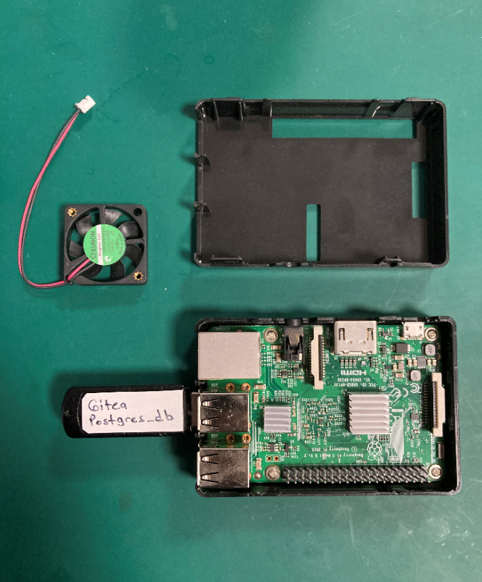
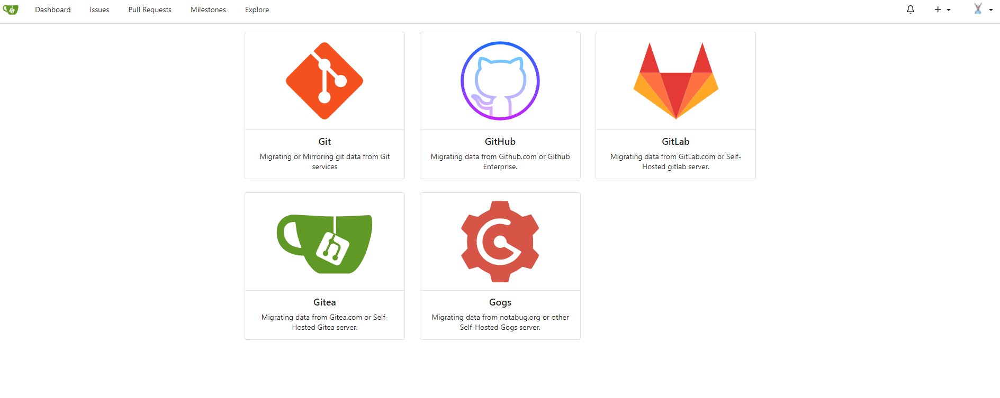
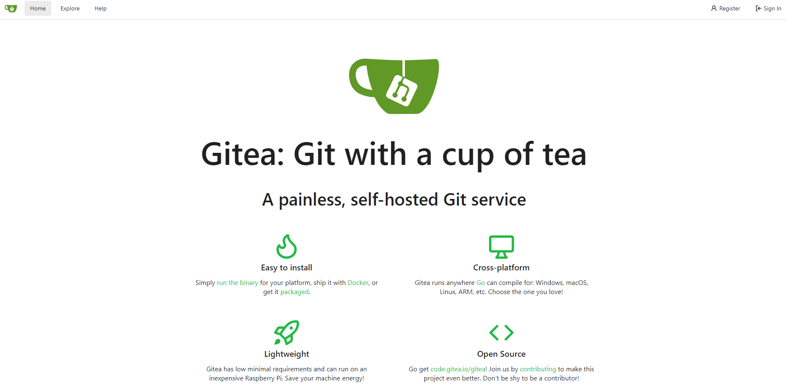

# Raspberry Pi Üzerinde Docker Compose Gitea Kurulumu

Gitea, go dilinde yazılmış Linux, MacOS, ve Windows cihazlar üzerinde çalışabilen bir Git Server uygulamasıdır.

# Motivasyon

Veri saklamak önemli bir konudur ve günümüzde veri saklamanın en doğru yolu git server üzerinde tutulmasıdır. Yerel ağda çalışan en az github, gitlab kadar hızlı bir git server olan Gitea ücretsiz ve güvenli seçeneklerden birisidir. En önemli güvenlik özelliği repository verisi kendi yerel deponuzda olmasıdır. 

Ayrıca Gitea LFS(Large File Storage) desteği sayesinde büyük dosya saklamanıza olanak sağlar. LAN hızınıza bağlı olarak yerelde ağda dosya saklamak için oldukça hızlı bir seçenektir. Projelerinize dahil olan büyük boyutlarda PDF, JPEG, MP4, MP3 dosyalarınızı database de verimli şekilde saklayabilir.

# Donanım Raspberry PI 3B

Aşağıda görmüş olduğunuz donanım bu server yazılımı koşturmak için fazlasıyla yeterli. yerel_ip:9000 portuna kurmuş olduğumuz Portainer yazılımı ile performası izleryebilir cpu kullanımın %10 larda süründüğünü görebilirsiniz. :) Doker stack ile birlikte kurulan diğer bir uygulama da php web arayüzü olan Adminer isimli küçük bir database izleme yazılımıdır. Bakım ve yedek alma için tercihen kullanılabilir.

Güvenilirliği nedeniyle database olarak advance open source database olan Postgres seçeneğini kullandım. Database dosyalarını harici bir USB bellek kullanarak depoladım. Bu gerektiğinde kapasiteyi genişletmemi sağlayacak (64gb, 128gb gibi usb flash diskler artık kolay bulunuyor) ve yedek alma işlerimi kolaylaştıracaktır. 

Resimde gördüğünüz fanı aldım ancak henüz monte etmedim yaklaşık 1 aydır CPU sıcaklıkları izliyorum ortalaması 50 derece civarındaydı. Server çalışma ortamına bağlı olarak ihtiyaca göre raspi-config menüsünden 70 derece ve üzerinde fanı çalıştırarak server cihazına hava soğutma özelliği kazandırabilirsiniz.

# Transfer

Gitea diğer portallardan repository transferi konusunda da oldukça çömert davranıyor ve transfer git işlemlerini kendisi yapıyor. 

Private Public farketmeksizin github projelerini doğrudan kendi yerel deponuza çekebiliyorsunuz.

  
# Sonuç

Gitea bence başarılı olmuş bir projedir. Efektif ekip yönetimi sağlar. Uygulama maliyeti düşüktür.
  
Yine ihtiyacınıza bağlı olarak serverınıza ip üzerinden değilde bir domain name üzerinden erişmek isterseniz duckdns.org, noip.com gibi free dinamik DNS sunucular işinizi görecektir. Ben duckdns tercih ediyorum.
  

  
Şimdi Çay molası :) 
  
  
